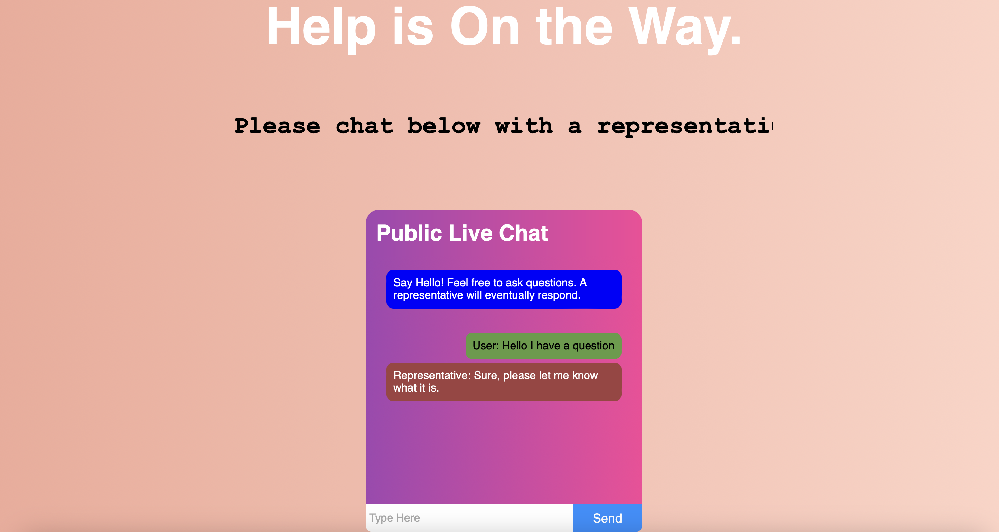
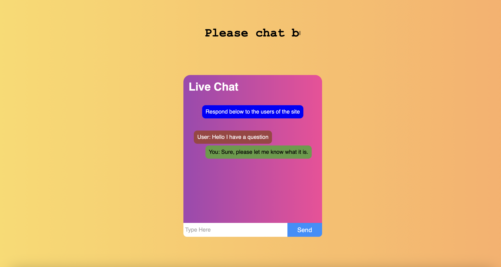
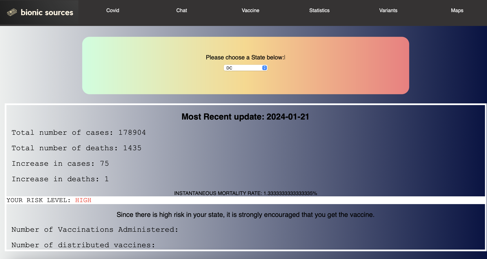

# BionicSources

Created by: Zakaria Chowdhury

This is a website inspired by COVID-19, which includes a variety of resources ranging from a chat feature, map section that marks all the nearby hospitals in the NYC area, and uses API data to give current health statistics.

Below is the chat program. There is a backend page in the respondent directory. All other files are for public use.
This is the public end of the site

  

This is the backend site for respondents

  

This part of the website takes advantage of an API to display relevant information:

  

[Click here](https://zc82531.github.io/Bionic-Sources/) to view the site.

To view the respondent site, you can [click here](https://zc82531.github.io/Bionic-Sources/respondent/respondent.html).

