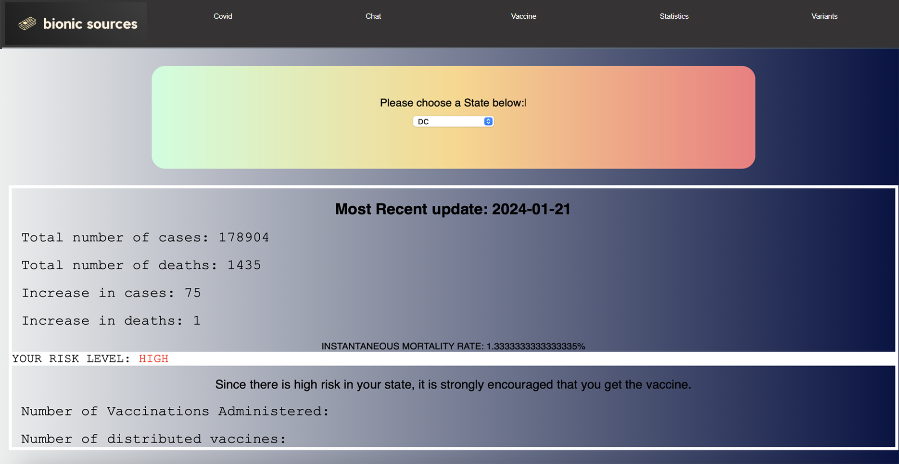

# BionicSources

## Overview
BionicSources is a comprehensive platform designed to provide essential information and resources related to health and safety during the COVID-19 pandemic. The website features a chat function, latest information, and real-time health statistics powered by an API.

## Features

### Public Site
- **Chat Feature:** Engage with users through our integrated chat system.
- **Health Statistics:** Access current health statistics via API integration.

  

### Respondent Backend
- **Backend Management:** Dedicated page for managing respondent interactions and data.

  

## API Integration
The site utilizes an API to fetch and display relevant health information. This ensures that users have access to the most current and accurate data.

  

## Links
- [View the Public Site](https://zc82531.github.io/Bionic-Sources/)
- [Access the Respondent Site](https://zc82531.github.io/Bionic-Sources/respondent/respondent.html)

